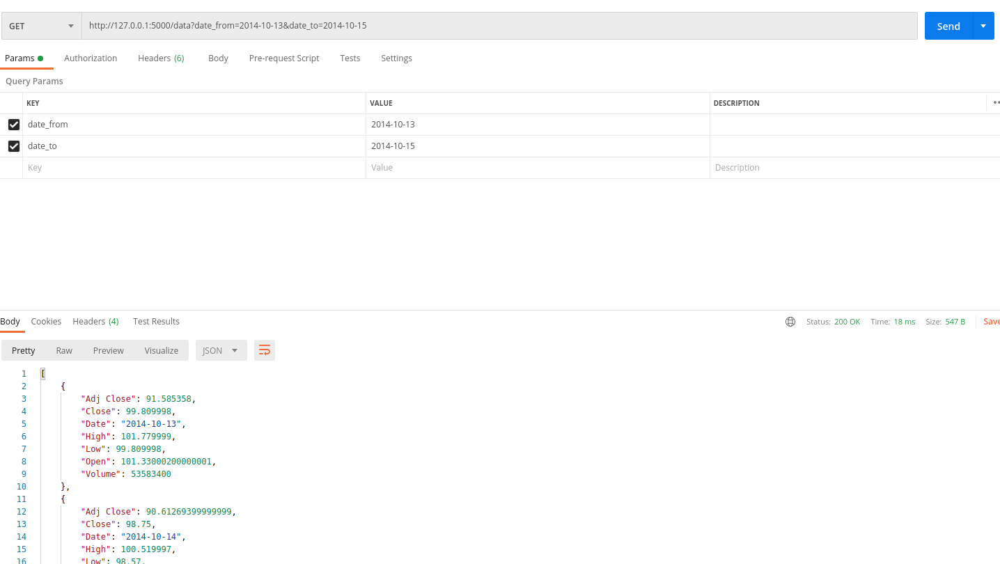

# Start
To start the service you need to copy the content of this repository and run `docker-compose up` inside this folder.

# Retrieving data

The user of this service has 3 options to get needed information where:
1. Date is strictly less than *date_to*
2. Date is strictly greater than *date_from*
3. Date is between *date_to* and *date_from*

According to this options the service will return `json` with corresponding information.

At the start `aapl.csv` file is loaded into the database(`sqlite`), and then the information is selected from it.

If user leave both dates empty then the warning message will be returned instead of `json`.

# Example

Here you can see an example how to retrieve data using Postman:

